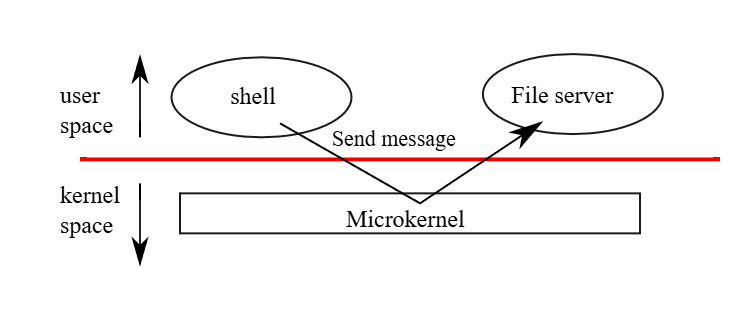
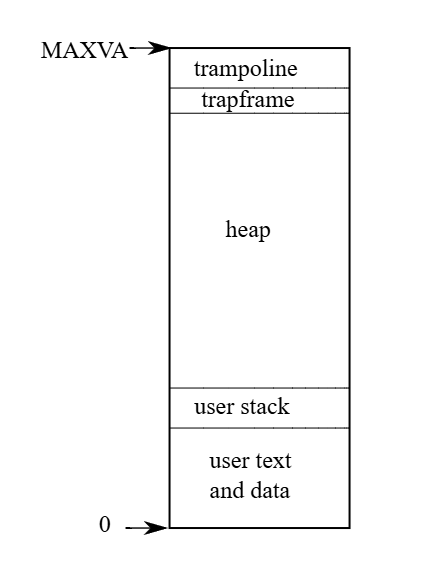

# xv6 riscv book chapter 2：Operating system organization

A key requirement for an operating system is to support several activities at once. For example, one might use the fork and exec system calls from Chapter 1 to start both a compiler and a text editor as processes. The operating system must time-share resources such as CPUs and memory among these processes. The operating system must also arrange for isolation between the processes. If one process has a bug and malfunctions, it shouldn’t affect unrelated processes. Complete isolation, however, is too strong, since it should be possible for processes to intentionally interact; pipelines are an example. Thus an operating system must fulfill three requirements: multiplexing, isolation, and interaction.

操作系统的一个核心需求是同时支持多个活动。例如，用户可以使用第 1 章中介绍的 fork 和 exec 系统调用，同时启动编译器和文本编辑器作为进程。操作系统必须在这些进程之间分时共享 CPU 和内存等资源。此外，操作系统还必须安排进程间的隔离。如果一个进程存在漏洞并发生故障，它不应影响无关的进程。然而，完全的隔离又过于绝对，因为进程之间应当能够进行有意的交互；管道就是一个例子。因此，操作系统必须满足三个需求：多路复用（multiplexing）、隔离（isolation）和交互（interaction）。

This chapter provides an overview of how operating systems are organized to achieve these three requirements. It turns out there are many ways to do so, but this text focuses on mainstream designs centered around a monolithic kernel, which is used by many Unix operating systems. This chapter also provides an overview of an xv6 process, the unit of isolation in xv6.

本章概述了为实现这三个需求而组织的操作系统架构。事实证明，实现方式有很多种，但本书重点关注以宏内核（monolithic kernel）为中心的主流设计，许多 Unix 操作系统都采用了这种设计。本章还概述了 xv6 进程，它是 xv6 中的隔离单位。

Xv6 runs on a multi-core RISC-V microprocessor, and much of its low-level functionality (for example, its process implementation) is specific to RISC-V. RISC-V is a 64-bit CPU, and xv6 is written in “LP64” C, which means long and pointers in the C programming language are 64 bits, but an int is 32 bits. This book assumes the reader has done a bit of machine-level programming on some architecture, and will introduce RISC-V-specific ideas as they come up. The user-level ISA [2] and privileged architecture [3] documents are the complete specifications. You may also refer to “The RISC-V Reader: An Open Architecture Atlas” [15].

Xv6 运行在多核 RISC-V 微处理器上，其许多底层功能（例如进程实现）是针对 RISC-V 特有的。RISC-V 是一种 64 位 CPU，xv6 使用“LP64” C 语言编写，这意味着 C 语言中的 long 和指针 是 64 位的，但 int 是 32 位的。本书假设读者曾在某种架构上进行过少量的机器级编程，并将在涉及 RISC-V 特定概念时进行介绍。用户级 ISA [2] 和特权架构 [3] 文档是完整的规范。你也可以参考《The RISC-V Reader: An Open Architecture Atlas》[15]。

The CPU in a complete computer is surrounded by support hardware, much of it in the form of I/O interfaces. Xv6 is written for the support hardware simulated by qemu’s “-machine virt” option. This includes RAM, a ROM containing boot code, a serial connection to the user’s keyboard/screen, and a disk for storage.

完整计算机中的 CPU 被外围硬件包围，其中大部分以 I/O 接口的形式存在。Xv6 是为 qemu 的“-machine virt”选项所模拟的硬件编写的。这包括 RAM、包含启动代码的 ROM、连接用户键盘/屏幕的串口以及用于存储的磁盘。

## 2.1 Abstracting physical resources

The first question one might ask when encountering an operating system is why have it at all? That is, one could implement the system calls in Figure 1.2 as a library, with which applications link. In this plan, each application could even have its own library tailored to its needs. Applications could directly interact with hardware resources and use those resources in the best way for the application (e.g., to achieve high or predictable performance). Some operating systems for embedded devices or real-time systems are organized in this way.

当人们接触到一个操作系统时，首先可能会问：为什么要存在操作系统？也就是说，人们完全可以将图 1.2 中的系统调用实现为一个库，并让应用程序与之链接。在这种方案下，每个应用程序甚至可以拥有根据自身需求定制的专属库。应用程序可以直接与硬件资源交互，并以最适合该程序的方式使用这些资源（例如，为了实现高性能或可预测的性能）。一些用于嵌入式设备或实时系统的操作系统就是以这种方式组织的。

The downside of this library approach is that, if there is more than one application running, the applications must be well-behaved. For example, each application must periodically give up the CPU so that other applications can run. Such a cooperative time-sharing scheme may be OK if all applications trust each other and have no bugs. It’s more typical for applications to not trust each other, and to have bugs, so one often wants stronger isolation than a cooperative scheme provides.

这种库方案的缺点是，如果有多个应用程序在运行，这些程序必须表现良好。例如，每个应用程序必须定期放弃 CPU，以便其他应用程序运行。如果所有应用程序都互相信任且没有漏洞，这种协作式分时方案可能行得通。但更常见的情况是，应用程序之间互不信任，且存在漏洞，因此人们通常希望获得比协作方案更强的隔离性。

To achieve strong isolation it’s helpful to forbid applications from directly accessing sensitive hardware resources, and instead to abstract the resources into services. For example, Unix applications interact with storage only through the file system’s open, read, write, and close system calls, instead of reading and writing the disk directly. This provides the application with the convenience of pathnames, and it allows the operating system (which provides the interface) to manage the disk. Even if isolation is not a concern, programs that interact intentionally (or just wish to keep out of each other’s way) are likely to find a file system a more convenient abstraction than direct use of the disk.

为了实现强隔离，禁止应用程序直接访问敏感硬件资源，转而将资源抽象为服务是很有帮助的。例如，Unix 应用程序仅通过文件系统的 open、read、write 和 close 系统调用与存储设备交互，而不是直接读写磁盘。这为应用程序提供了路径名的便利，并允许操作系统（接口的提供者）管理磁盘。即使不考虑隔离问题，那些有意进行交互（或仅仅希望互不干扰）的程序，也可能会发现文件系统是比直接使用磁盘更方便的抽象。

Similarly, Unix transparently switches hardware CPUs among processes, saving and restoring register state as necessary, so that applications don’t have to be aware of time-sharing. This transparency allows the operating system to share CPUs even if some applications are in infinite loops.

类似地，Unix 在进程之间透明地切换硬件 CPU，根据需要保存和恢复寄存器状态，从而使应用程序无需感知分时机制。这种透明性允许操作系统共享 CPU，即使某些应用程序处于死循环中也是如此。

As another example, Unix processes use exec to build up their memory image, instead of directly interacting with physical memory. This allows the operating system to decide where to place a process in memory; if memory is tight, the operating system might even store some of a process’s data on disk. exec also provides users with the convenience of a file system to store executable program images.

再举一个例子，Unix 进程使用 exec 来构建其内存镜像，而不是直接与物理内存交互。这允许操作系统决定将进程放置在内存的什么位置；如果内存紧张，操作系统甚至可以将进程的部分数据存储在磁盘上。exec 还为用户提供了利用文件系统存储可执行程序镜像的便利。

Many forms of interaction among Unix processes occur via file descriptors. Not only do file descriptors abstract away many details (e.g., where data in a pipe or file is stored), they are also defined in a way that simplifies interaction. For example, if one application in a pipeline exits or fails, the kernel automatically generates an end-of-file signal for the next process in the pipeline.

Unix 进程之间的许多交互形式都是通过文件描述符进行的。文件描述符不仅抽象掉了许多细节（例如，管道或文件中的数据存储在哪里），而且其定义方式也简化了交互。例如，如果流水线中的一个应用程序退出或失败，内核会自动为流水线中的下一个进程生成一个文件结束（EOF）信号。

The system-call interface in Figure 1.2 is carefully designed to provide both programmer convenience and the possibility of strong isolation. The Unix interface is not the only way to abstract resources, but it has proved to be a good one.

图 1.2 中的系统调用接口经过精心设计，既提供了程序员的便利性，又提供了强隔离的可能性。Unix 接口并不是抽象资源的唯一方式，但事实证明它是一个很好的方式。

## 2.2 User mode, supervisor mode, and system calls

Strong isolation requires a hard boundary between applications and the operating system. Applications shouldn’t be allowed to disturb the operation of the operating system or other programs, even if the application has a bug or is malicious. To achieve strong isolation, the operating system must arrange that applications cannot modify (or even read) the operating system’s data structures and instructions and that applications cannot access other processes’ memory.

强隔离要求在应用程序和操作系统之间建立一道坚固的边界。不应允许应用程序干扰操作系统或其他程序的运行。即使应用程序存在漏洞或具有恶意。为了实现强隔离，操作系统必须安排应用程序无法修改（甚至无法读取）操作系统的核心数据结构和指令，并且应用程序无法访问其他进程的内存。

CPUs provide hardware support for strong isolation. For example, RISC-V has three privilege levels which constrain what code can do: machine mode, supervisor mode, and user mode. Instructions executing in machine mode have full privilege; a CPU starts in machine mode. Machine mode is mostly intended for setting up the computer during boot. Xv6 executes briefly in machine mode and then changes to supervisor mode.

CPU 为强隔离提供硬件支持。例如，RISC-V 有三个特权级，用于限制代码的行为：机器模式（machine mode）、监管者模式（supervisor mode）和用户模式（user mode）。在机器模式下执行的指令具有最高特权；CPU 在启动时处于机器模式。机器模式主要用于在启动期间设置计算机。Xv6 在机器模式下短暂执行，然后切换到监管者模式。

In supervisor mode the CPU is allowed to execute privileged instructions: for example, enabling and disabling interrupts, reading and writing the register that holds the address of the page table, etc. If an application in user mode attempts to execute a privileged instruction, then the CPU doesn’t execute the instruction, but “traps” to special code in supervisor mode that can terminate the application. Figure 1.1 in Chapter 1 illustrates this organization. An application can execute only user-mode instructions (e.g., adding numbers, etc.) and is said to be running in user space, while the software in supervisor mode can also execute privileged instructions and is said to be running in kernel space. The software running in kernel space (or in supervisor mode) is called the kernel.

在监管者模式（supervisor mode）下，CPU 被允许执行特权指令：例如，开启和关闭中断、读写保存页表地址的寄存器等。如果处于用户模式（user mode）的应用程序尝试执行特权指令，CPU 不会执行该指令，而是“陷入”（trap）到监管者模式下的特定代码中，该代码可以终止该应用程序。第 1 章中的图 1.1 展示了这种结构。应用程序只能执行用户模式指令（例如，数字加法等），并被称为运行在用户空间（user space），而监管者模式下的软件还可以执行特权指令，并被称为运行在内核空间（kernel space）。运行在内核空间（或监管者模式）下的软件被称为内核（kernel）。

Applications interact with the kernel via system calls calls such as read. Applications are not allowed to directly call kernel functions or access the kernel’s memory. RISC-V provides the ecall instruction for system calls; it switches the CPU from user to supervisor mode and jumps to a kernel-specified entry point. Once the CPU has switched to supervisor mode, the kernel can then validate the arguments of the system call (e.g., check if the address passed to the system call is part of the application’s memory), decide whether the application is allowed to perform the requested operation (e.g., check if the application is allowed to write the specified file), and then deny it or execute it. It is important that the kernel control the entry point for transitions to supervisor mode; if the application could decide the kernel entry point, a malicious application could, for example, enter the kernel at a point where the validation of arguments is skipped.

应用程序通过诸如 read 之类的系统调用与内核交互。应用程序不允许直接调用内核函数或访问内核内存。RISC-V 为系统调用提供了 ecall 指令；它将 CPU 从用户模式切换到监管者模式，并跳转到内核指定的入口点。一旦 CPU 切换到监管者模式，内核就可以验证系统调用的参数（例如，检查传递给系统调用的地址是否属于应用程序内存的一部分），决定是否允许应用程序执行请求的操作（例如，检查是否允许应用程序写入指定文件），然后拒绝或执行该操作。内核控制进入监管者模式的入口点至关重要；如果应用程序可以决定内核入口点，那么恶意程序就可以在跳过参数验证的位置进入内核。

## 2.3 Kernel organization

A key design question is what part of the operating system should run in supervisor mode. One possibility is that the entire operating system resides in the kernel, so that the implementations of all system calls run in supervisor mode. This organization is called a monolithic kernel.

一个关键的设计问题是操作系统的哪一部分应该运行在监管者模式下。一种可能性是整个操作系统都驻留在内核中，这样所有系统调用的实现都运行在监管者模式下。这种组织结构被称为宏内核（monolithic kernel）。

In a monolithic organization the entire operating system consists of a single program running in supervisor mode. One reason this organization is convenient is that the OS designer doesn’t have to divide code into parts that do and do not require supervisor privileges. Furthermore, it is easy for different parts of the operating system to cooperate, since they are parts of a single program. For example, a monolithic kernel might share a disk block cache with the file system and the virtual memory system.

在宏内核结构中，整个操作系统由运行在监管者模式下的单个程序组成。这种结构之所以方便，原因之一是操作系统设计者不必将代码划分为需要和不需要监管者权限的部分。此外，由于它们是单个程序的组成部分，操作系统不同部分之间的协作也变得很容易。例如，宏内核可以在文件系统和虚拟内存系统之间共享磁盘块缓存。

A downside is that monolithic kernels tend to grow large and complex, so that no one developer understands all of the interactions between different parts of the code; this is a recipe for bugs. A bug in the kernel is particularly troublesome because it may cause the entire computer to crash,

单体内核的一个缺点是它们往往变得庞大且复杂，以至于没有哪一个开发人员能理解代码不同部分之间的所有交互；这是产生漏洞的根源。内核中的漏洞尤其麻烦，因为它可能导致整个计算机崩溃，

or cause many applications to malfunction, or make the entire computer vulnerable to security attacks.

或者导致许多应用程序运行异常，或者使整个计算机容易受到安全攻击。

A microkernel aims to reduce the incidence of bugs in the kernel. The idea is to put an absolute minimum of functionality in the kernel itself, so that little code executes in supervisor mode, and so that the kernel is easy to understand and analyze for correctness. The bulk of the operating system runs as user-level server processes. For example, the file system code would execute as a server process, in user mode rather than supervisor mode.

微内核旨在减少内核中漏洞的发生率。其核心思想是将功能尽可能少地保留在内核本身中，从而使在监管模式（supervisor mode）下执行的代码很少，并且使内核易于理解和进行正确性分析。操作系统的大部分功能作为用户级服务器进程运行。例如，文件系统代码将作为服务器进程在用户模式而非监管模式下执行。

Figure 2.1 illustrates this microkernel design. In the figure, the file system runs as a user-level server process. To allow applications to interact with the file server, the kernel provides an interprocess communication mechanism to send messages from one user-mode process to another. For example, if an application like the shell wants to read or write a file, it sends a message to the file server and waits for a response.

图 2.1 展示了这种微内核设计。在图中，文件系统作为一个用户级服务器进程运行。为了允许应用程序与文件服务器交互，内核提供了一种进程间通信机制，用于将消息从一个用户模式进程发送到另一个。例如，如果像 shell 这样的应用程序想要读取或写入文件，它会向文件服务器发送一条消息并等待响应。

In a microkernel, the kernel interface consists of a few low-level functions for starting applications, sending messages, accessing device hardware, etc. This organization allows the kernel to be relatively simple, as most of the operating system resides in user-level servers.

在微内核架构中，内核接口由少数底层函数组成，用于启动应用程序、发送消息、访问设备硬件等。这种组织方式使内核能够保持相对简单，因为操作系统的大部分功能都驻留在用户级服务器中。

In the real world, both monolithic kernels and microkernels are popular. Many Unix kernels are monolithic. For example, Linux has a monolithic kernel, although some OS functions run as user-level servers (e.g., the window system). Linux delivers high performance to OS-intensive applications, partially because the subsystems of the kernel can be tightly integrated.

在现实世界中，宏内核和微内核都很流行。许多 Unix 内核都是宏内核。例如，Linux 拥有一个宏内核，尽管某些操作系统功能（如窗口系统）以用户级服务器的形式运行。Linux 为操作系统密集型应用提供了高性能，部分原因在于内核的各个子系统可以紧密集成。

Operating systems such as Minix, L4, and QNX are organized as a microkernel with servers, and have seen wide deployment in embedded settings. A variant of L4, seL4, is small enough that it has been verified for memory safety and other security properties [8].

诸如 Minix、L4 和 QNX 等操作系统被组织为带有服务器的微内核，并在嵌入式领域得到了广泛部署。L4 的一个变体 seL4 非常小，以至于它已经通过了内存安全和其他安全属性的验证 [8]。

There is much debate among developers of operating systems about which organization is better, but there is no conclusive evidence one way or the other. Furthermore, it depends much on what “better” means: faster performance, smaller code size, reliability of the kernel, reliability of the complete operating system (including user-level services), etc.

操作系统开发者之间关于哪种组织方式更好的争论很多，但目前还没有定论。此外，这在很大程度上取决于“更好”的定义：是更快的性能、更小的代码体积、内核的可靠性，还是整个操作系统（包括用户级服务）的可靠性等。

There are also practical considerations that may be more important than the question of which organization. Some operating systems have a microkernel but run some of the user-level services in kernel space for performance reasons. Some operating systems have monolithic kernels because that is how they started and there is little incentive to move to a pure microkernel organization, because new features may be more important than rewriting the existing operating system to fit a microkernel design.

除了组织方式的问题外，还有一些可能更为重要的实际考量。出于性能原因，一些操作系统虽然采用微内核，但会在内核空间运行部分用户级服务。一些操作系统采用宏内核是因为其起步如此，且由于开发新功能可能比重写现有操作系统以适应微内核设计更为重要，因此缺乏转向纯微内核架构的动力。

From this book’s perspective, microkernel and monolithic operating systems share many key ideas. They implement system calls, they use page tables, they handle interrupts, they support

从本书的角度来看，微内核和宏内核操作系统共享许多关键理念。它们都实现系统调用，使用页表，处理中断，并支持

|  | File | Description |
| Boot | entry.S | Very first boot instructions. |
|  | main.c | Control initialization of other modules. |
| Processes | start.c | exec() system call. |
|  | proc.c | Processes and scheduling. |
|  | swtch.S | Thread switching. |
|  | sysproc.c | Process-related system calls. |
| Traps | kernelvec.S | Handle traps from kernel code. |
|  | trampoline.S | Handle traps from user code. |
|  | trap.c | C code to handle and return from traps and interrupts. |
| Memory | vm.c | Manage page tables and address spaces. |
|  | kalloc.c | Physical page allocator. |
| Devices | plic.c | RISC-V interrupt controller. |
|  | printf.c | Formatted output to the console. |
|  | uart.c | Serial-port console device driver. |
|  | virtio_disk.c | Disk device driver. |
| FS | bio.c | Disk block cache for the file system. |
|  | file.c | File descriptor support. |
|  | fs.c | File system. |
|  | pipe.c | File system logging and crash recovery. |
| Misc | sleeplock.c spinlock.c string.c | Locks that don't yield the CPU. |

processes, they use locks for concurrency control, they implement a file system, etc. This book focuses on these core ideas.

它们管理进程，使用锁进行并发控制，实现文件系统等。本书重点关注这些核心概念。

Xv6 is implemented as a monolithic kernel, like most Unix operating systems. Thus, the xv6 kernel interface corresponds to the operating system interface, and the kernel implements the complete operating system. Since xv6 doesn’t provide many services, its kernel is smaller than some microkernels, but conceptually xv6 is monolithic.

Xv6 采用宏内核（monolithic kernel）设计，正如大多数 Unix 操作系统一样。因此，xv6 的内核接口即等同于操作系统接口，内核实现了完整的操作系统功能。由于 xv6 提供的服务并不多，其内核体积甚至比某些微内核还要小，但从概念上讲，xv6 仍属于宏内核架构。

## 2.4 Code: xv6 organization

The xv6 kernel source is in the kernel/ sub-directory. Figure 2.2 lists the files, divided into the major areas of kernel responsibility: starting the system (booting), creating and controlling

xv6 内核源码位于 kernel/ 子目录下。图 2.2 列出了这些文件，并按内核职责的主要领域进行了划分：系统启动（引导）、创建与控制

processes, handling traps (interrupts and system calls), allocating memory and configuring virtual addresses, controlling devices, and managing the file-system.

进程管理、陷阱处理（中断和系统调用）、内存分配与虚拟地址配置、设备控制以及文件系统管理。

## 2.5 Process overview

The unit of isolation in xv 6 (as in other Unix operating systems) is a process. The process abstraction prevents one process from wrecking or spying on another process’s memory, CPU, file descriptors, etc. It also prevents a process from wrecking the kernel itself, so that a process can’t subvert the kernel’s isolation mechanisms. The kernel must implement the process abstraction with care because a buggy or malicious application may trick the kernel or hardware into doing something bad (e.g., circumventing isolation). The mechanisms used by the kernel to implement processes include the user/supervisor mode flag, address spaces, and time-slicing of threads.

xv6（以及其他 Unix 操作系统）中的隔离单位是进程。进程抽象防止了一个进程破坏或窥探另一个进程的内存、CPU、文件描述符等。它还防止了进程破坏内核本身，从而使进程无法破坏内核的隔离机制。内核必须谨慎地实现进程抽象，因为带有漏洞或恶意软件的应用程序可能会诱导内核或硬件做出错误行为（例如绕过隔离）。内核用于实现进程的机制包括用户/特权模式标志、地址空间以及线程的时间分片。

To help enforce isolation, the process abstraction provides the illusion to a program that it has its own private machine. A process provides a program with what appears to be a private memory system, or address space, which other processes cannot read or write. A process also provides the program with what appears to be its own CPU to execute the program’s instructions.

为了帮助强制执行隔离，进程抽象为程序提供了一种拥有独立私有机器的假象。进程为程序提供了一个看似私有的内存系统（即地址空间），其他进程无法对其进行读写。进程还为程序提供了一个看似独立的 CPU 来执行程序的指令。

Xv6 uses page tables (which are implemented by hardware) to give each process its own address space. The RISC-V page table translates (or “maps”) a virtual address (the address that an RISC-V instruction manipulates) to a physical address (an address that the CPU sends to main memory).

xv6 使用页表（由硬件实现）为每个进程提供其独立的地址空间。RISC-V 页表将虚拟地址（RISC-V 指令操作的地址）翻译（或“映射”）为物理地址（CPU 发送到主存的地址）。

* [ ] Xv6 maintains a separate page table for each process that defines that process’s address space. As illustrated in Figure 2.3, an address space includes the process’s user memory starting at virtual address zero. Instructions come first, followed by global variables, then the stack, and finally a “heap” area (for malloc) that the process can expand as needed. There are a number of factors that limit the maximum size of a process’s address space: pointers on the RISC-V are 64 bits wide; the hardware uses only the low 39 bits when looking up virtual addresses in page tables; and xv6 uses only 38 of those 39 bits. Thus, the maximum address is x3fffffffff, which is MAXVA (0899). At the top of the address space xv6 places a trampoline page ( 4096 bytes) and a trapframe page. Xv6 uses these two pages to transition into the kernel and back; the trampoline page contains the code to transition in and out of the kernel, and the trapframe is where the kernel saves the process’s user registers, as Chapter 4 explains.

Xv6 为每个进程维护一个单独的页表，用以定义该进程的地址空间。如图 2.3 所示，地址空间包括从虚拟地址零开始的进程用户内存。首先是指令，其次是全局变量，然后是栈，最后是一个”堆”区（用于 malloc），进程可以根据需要对其进行扩展。有几个因素限制了进程地址空间的最大容量：RISC-V 上的指针宽度为 64 位；硬件在页表中查找虚拟地址时仅使用低 39 位；而 xv6 仅使用了这 39 位中的 38 位。因此，最大地址是 x3fffffffff，即 MAXVA (0899)。在地址空间的顶部，xv6 放置了一个 trampoline（跳板）页（4096 字节）和一个 trapframe（中断帧）页。Xv6 利用这两个页进入内核并返回；trampoline 页包含进出内核的代码，而 trapframe 则是内核保存进程用户寄存器的地方，详见第 4 章。

The xv6 kernel maintains many pieces of state for each process, which it gathers into a struct proc (2034). A process’s most important pieces of kernel state are its page table, its kernel stack, and its run state. We’ll use the notation to refer to elements of the proc structure; for example, pagetable is a pointer to the process’s page table.

Xv6 内核为每个进程维护了许多状态信息，并将它们集中在 struct proc (2034) 中。一个进程最重要的内核状态包括它的页表、内核栈和运行状态。我们将使用符号 来引用 proc 结构的元素；例如， pagetable 是指向进程页表的指针。

At this point, please read kernel/proc.h, which defines struct proc. The xv6 code is more important for you to understand than this book; you should prioritize the code, and consult this book as needed to clarify the code. The purpose of some of the code may not be apparent at first, but further reading and searching the code will help. Feel free to explore and modify the code.

此时，请阅读定义了 struct proc 的 kernel/proc.h。理解 xv6 代码比阅读本书更重要；你应该优先阅读代码，并在需要澄清代码时参考本书。某些代码的用途起初可能并不明显，但进一步阅读和搜索代码会有所帮助。请随意探索和修改代码。

Each process has a thread of control (or thread for short) that holds the state needed to execute the process. At any given time, a thread might be executing on a CPU, or suspended (not executing, but capable of resuming executing in the future). To switch a CPU between processes, the kernel suspends the thread currently running on that CPU and saves its state, and restores the state of another process’s previously-suspended thread. Much of the state of a thread (local variables, function call return addresses) is stored on the thread’s stacks. Each process has two stacks: a user stack and a kernel stack ( ). When the process is executing user instructions, only its user stack is in use, and its kernel stack is empty. When the process enters the kernel (for a system call or interrupt), the kernel code executes on the process’s kernel stack; while a process is in the kernel, its user stack still contains saved data, but isn’t actively used. A process’s thread alternates between actively using its user stack and its kernel stack. The kernel stack is separate (and protected from user code) so that the kernel can execute even if a process has wrecked its user stack.

每个进程都有一个控制线程（简称线程），其中保存了执行该进程所需的状态。在任何给定时间，线程可能正在 CPU 上执行，或者处于挂起状态（未执行，但将来可以恢复执行）。为了在进程之间切换 CPU，内核会挂起当前在该 CPU 上运行的线程并保存其状态，然后恢复另一个进程之前挂起的线程状态。线程的大部分状态（局部变量、函数调用返回地址）都存储在线程的栈中。每个进程有两个栈：用户栈和内核栈（ ）。当进程执行用户指令时，仅使用其用户栈，而其内核栈是空的。当进程进入内核（通过系统调用或中断）时，内核代码在进程的内核栈上执行；当进程在内核中时，其用户栈仍包含保存的数据，但并未被活跃使用。进程的线程在活跃使用用户栈和内核栈之间交替。内核栈是独立的（并且受到保护，不受用户代码影响），因此即使进程破坏了其用户栈，内核也可以正常执行。

A process’s user code can make a system call by executing the RISC-V ecall instruction. This instruction switches to supervisor mode and changes the program counter to a kernel-defined entry point. The code at the entry point switches to the process’s kernel stack and executes the kernel instructions that implement the system call. When the system call completes, the kernel returns to user space by executin the sret instruction, which switches to user mode and resumes executing user instructions just after the system call instruction. A process’s thread can “block” in the kernel to wait for I/O, and resume where it left off when the I/O has finished. p->state indicates whether the process is allocated, ready to run, currently running on a CPU, waiting for I/O, or exiting. pagetable holds the process’s page table, in the format that the RISC-V hardware expects. Xv6 causes the paging hardware to use a process’s pagetable when executing that process in user space. A process’s page table also serves as the record of the addresses of the physical pages allocated to store the process’s memory.

进程的用户代码可以通过执行 RISC-V 的 `ecall` 指令来发起系统调用。该指令会切换到特权模式（supervisor mode），并将程序计数器（PC）更改为内核定义的入口点。入口点处的代码会切换到进程的内核栈，并执行实现系统调用的内核指令。当系统调用完成后，内核通过执行 `sret` 指令返回用户空间，该指令会切换回用户模式，并在紧随系统调用指令之后的位置恢复执行用户指令。进程的线程可以在内核中“阻塞”以等待 I/O，并在 I/O 完成后从上次中断的地方恢复执行。p->state 指示了进程的状态：是已分配、就绪、正在 CPU 上运行、正在等待 I/O 还是正在退出。 pagetable 持有进程的页表，其格式符合 RISC-V 硬件的预期。当进程在用户空间执行时，Xv6 会使分页硬件使用该进程的 pagetable。进程的页表还充当了记录分配给该进程内存的物理页地址的记录表。

In summary, a process bundles two design ideas: an address space to give a process the illusion of its own memory, and a thread to give the process the illusion of its own CPU. In xv6, a process consists of one address space and one thread. In real operating systems a process may have more than one thread to take advantage of multiple CPUs.

总而言之，进程结合了两个设计理念：一个是地址空间，用以给进程提供拥有独立内存的错觉；另一个是线程，用以给进程提供拥有独立 CPU 的错觉。在 xv6 中，一个进程由一个地址空间和一个线程组成。在真实的操作系统中，一个进程可能会包含更多线程。多个线程以利用多 CPU 的优势。

## 2.6 Code: starting xv6, the first process and system call

To make xv6 more concrete, we’ll outline how the kernel starts and runs the first process. The subsequent chapters will describe the mechanisms that show up in this overview in more detail. Please read kernel/entry.S, kernel/start.c, kernel/main.c, and user/init.c.

为了使 xv6 更加具体，我们将概述内核如何启动并运行第一个进程。后续章节将更详细地描述本概述中出现的机制。请阅读 kernel/entry.S、kernel/start.c、kernel/main.c 以及 user/init.c。

When the RISC-V computer powers on, it initializes itself and runs a boot loader which is stored in read-only memory. The boot loader copies the xv6 kernel into memory at physical address . The reason it places the kernel at rather than is because the address range contains I/O devices.

当 RISC-V 计算机上电时，它会进行自检并运行存储在只读存储器中的引导加载程序（boot loader）。引导加载程序将 xv6 内核复制到物理地址 处的内存中。之所以将内核放在 而不是 ，是因为 地址范围包含 I/O 设备。

Then the boot loader jumps to xv6 starting at _entry (1006). The RISC-V starts with paging hardware disabled: virtual addresses map directly to physical addresses. The instructions at _entry set up a stack so that xv6 can run C code. Xv6 declares space for this stack, stack0, in the file start.c (1060). The code at _entry loads the stack pointer register sp with the address stack , the top of the stack, because the stack on RISC-V grows down. Now that the kernel has a stack, _entry calls into C code at start (1064).

随后，引导加载程序跳转到 xv6 的入口点 _entry (1006) 开始执行。RISC-V 启动时分页硬件处于禁用状态：虚拟地址直接映射到物理地址。_entry 处的指令设置了一个栈，以便 xv6 可以运行 C 代码。Xv6 在 start.c (1060) 文件中为该栈（stack0）声明了空间。_entry 处的代码将栈指针寄存器 sp 加载为地址 stack （即栈顶），因为 RISC-V 上的栈是向下增长的。现在内核有了栈，_entry 调用 start (1064) 处的 C 代码。

The function start performs some setup that the CPU only allows in machine mode, most crucially programming the clock chip to generate timer interrupts. Then start uses the RISCV mret instruction to switch to supervisor mode and jump to main (1160), mret requires a bit of setup: start sets the previous privilege mode to supervisor in the register mstatus, sets the destination address to main by writing main’s address into the register mepc, disables virtual address translation in supervisor mode by writing 0 into the page-table register satp, and delegates all interrupts and exceptions to supervisor mode.

函数 start 执行一些 CPU 仅允许在机器模式（machine mode）下进行的设置，最关键的是编程时钟芯片以产生定时器中断。然后，start 使用 RISC-V 的 mret 指令切换到监管者模式（supervisor mode）并跳转到 main (1160)。mret 需要一些准备工作：start 在 mstatus 寄存器中将前一个特权模式设置为监管者模式，通过将 main 的地址写入 mepc 寄存器来设置目标地址，通过向页表寄存器 satp 写入 0 来禁用监管者模式下的虚拟地址转换，并将所有中断和异常委托给监管者模式。

After main (1160) initializes several devices and subsystems, it creates the first process by calling userinit (2327). All newly created processes start executing in the kernel in forkret (2653). As a special case for the first process, forkret calls kexec to load the user program /init.

在 main (1160) 初始化了多个设备和子系统后，它通过调用 userinit (2327) 创建第一个进程。所有新创建的进程都在内核中的 forkret (2653) 开始执行。作为第一个进程的特殊情况，forkret 调用 kexec 来加载用户程序 /init。

After calling kexec, forkret returns to user space in the / init process. init (7764) creates a new console device file if needed and then opens it as file descriptors 0,1 , and 2 . Then it starts a shell on the console. The system is up.

调用 kexec 后，forkret 返回到 /init 进程的用户空间。init (7764) 在需要时创建一个新的控制台设备文件，然后将其作为文件描述符 0、1 和 2 打开。接着，它在控制台上启动一个 shell。至此，系统已启动就绪。

## 2.7 Security Model

You may wonder how the operating system deals with buggy or malicious code. Because coping with malice is strictly harder than dealing with accidental bugs, it’s reasonable to focus mostly on providing security against malice. Here’s a high-level view of typical security assumptions and goals in operating system design.

你可能会好奇操作系统是如何处理错误代码或恶意代码的。由于应对恶意行为严格来说比处理意外错误更难，因此将重点主要放在防御恶意行为上是合理的。以下是操作系统设计中典型安全假设和目标的高层视图。

The operating system must assume that a process’s user-level code will do its best to wreck the kernel or other processes. User code may try to dereference pointers outside its allowed address space; it may attempt to execute instructions not intended for user code; it may try to read and write RISC-V control registers; it may try to access device hardware; and it may pass clever values to system calls in an attempt to trick the kernel into crashing or doing something stupid.

操作系统必须假设进程的用户级代码会竭尽全力破坏内核或其他进程。用户代码可能会尝试解引用其允许地址空间之外的指针；它可能会尝试执行非用户代码预期的指令；它可能会尝试读取并用户级进程可能会尝试运行特权指令；它可能尝试读写 RISC-V 控制寄存器；它可能尝试访问设备硬件；它还可能向系统调用传递精心构造的值，试图诱导内核崩溃或执行错误操作。

The kernel’s goal is to restrict each user process so that it can only access its own user memory, use the 32 general-purpose RISC-V registers, and affect the kernel and other processes in the ways that system calls are intended to allow. The kernel must prevent any other actions. These are typically absolute requirements in kernel design.

内核的目标是限制每个用户进程，使其只能访问自己的用户内存，使用 32 个 RISC-V 通用寄存器，并仅以系统调用预期的允许方式影响内核和其他进程。内核必须阻止任何其他行为。这些通常是内核设计中的绝对要求。

Expectations for the kernel’s own code are different. Kernel code is assumed to be written by well-meaning and careful programmers, to be bug-free, and to contain nothing malicious. This assumption affects how we analyze kernel code. For example, there are many internal kernel functions (e.g., the spin locks) that would cause serious problems if kernel code used them incorrectly. We assume, however, that the kernel uses its own functions correctly. At the hardware level, the RISC-V CPU, RAM, disk, etc. are assumed to operate as advertised in the documentation, with no hardware bugs.

对内核自身代码的期望则不同。我们假设内核代码是由心怀善意且谨慎的程序员编写的，没有漏洞，且不包含任何恶意内容。这一假设影响了我们分析内核代码的方式。例如，内核中有许多内部函数（如自旋锁），如果内核代码错误地使用它们，将会导致严重问题。然而，我们假设内核能够正确地使用其自身函数。在硬件层面，假设 RISC-V CPU、内存、磁盘等均按照文档说明正常运行，不存在硬件漏洞。

Real life is not so straightforward. It’s difficult to prevent abusive user programs from calling system calls in a way that makes the system unusable by consuming kernel-protected resources: disk space, CPU time, process table slots, etc. It’s usually impossible to write bug-free kernel code or design bug-free hardware; if the writers of malicious user code are aware of kernel or hardware bugs, they will exploit them. Even in mature, widely-used kernels, such as Linux, people often discover previously-unknown vulnerabilities [1]. Finally, the distinction between user and kernel code is sometimes blurred: some privileged user-level processes may provide essential services and effectively be part of the operating system, and in some operating systems privileged user code can insert new code into the kernel (as with Linux’s loadable kernel modules and eBPF).

现实情况并非如此简单。很难防止滥用程序的恶意用户以消耗内核保护资源（如磁盘空间、CPU 时间、进程表槽位等）的方式调用系统调用，从而导致系统无法使用。编写完全没有漏洞的内核代码或设计无缺陷的硬件通常是不可能的；如果恶意代码的编写者意识到内核或硬件漏洞，他们就会利用这些漏洞。即使在像 Linux 这样成熟且广泛使用的内核中，人们也经常发现以前未知的漏洞 [1]。最后，用户代码和内核代码之间的界限有时是模糊的：一些特权级用户进程可能提供核心服务，实际上是操作系统的一部分；而在某些操作系统中，特权用户代码可以向内核插入新代码（例如 Linux 的可加载内核模块和 eBPF）。

As a partial defense against kernel bugs, xv6 code includes checks for inconsistencies and unrecoverable errors, and will “panic” in response, by calling panic (). This function prints an error message and halts the system. Panicking is not desirable, but is preferable to continuing execution. Typically a panic results from a kernel bug that causes kernel data to be incorrect or causes the kernel to perform an illegal action such as referencing non-existent memory; in such a situation it is safer to halt execution with panic () than to try to continue in an inconsistent state. A kernel developer would react to a panic by working to identify and fix the underlying code bug.

作为针对内核漏洞的部分防御措施，xv6 代码包含了对不一致性和不可恢复错误的检查，并会通过调用 panic() 来进行“恐慌”响应。该函数会打印错误消息并停止系统运行。触发 Panic 并非理想情况，但总比继续执行要好。通常，Panic 是由内核漏洞导致的，这些漏洞会导致内核数据错误或导致内核执行非法操作（如引用不存在的内存）；在这种情况下，使用 panic() 停止执行比在不一致的状态下尝试继续运行更安全。内核开发人员会对 Panic 做出反应，努力识别并修复底层的代码漏洞。

## 2.8 Real world

Most operating systems have adopted the process concept, and most processes look similar to xv6’s. Modern operating systems, however, support several threads within a process, to allow a single process to exploit multiple CPUs. Supporting multiple threads in a process involves quite a bit of machinery that xv6 doesn’t have, often including interface changes (e.g., Linux’s clone, a variant of fork), to control which aspects of a process threads share.

大多数操作系统都采用了进程概念，且大多数进程与 xv6 的进程相似。然而，现代操作系统支持在一个进程内运行多个线程，以允许单个进程利用多个 CPU。在一个进程中支持多线程涉及大量 xv6 所不具备的机制，通常包括接口更改（例如 Linux 的 clone，它是 fork 的一种变体），用以控制线程共享进程的哪些方面。

## 2.9 Exercises

1. Add a system call to xv 6 that returns the amount of free memory available.
   为 xv6 添加一个系统调用，用于返回当前可用空闲内存的数量。
