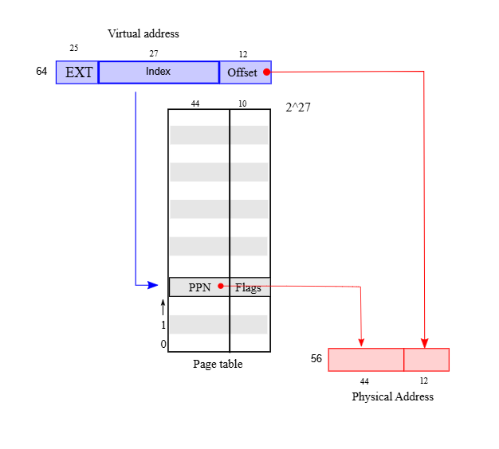
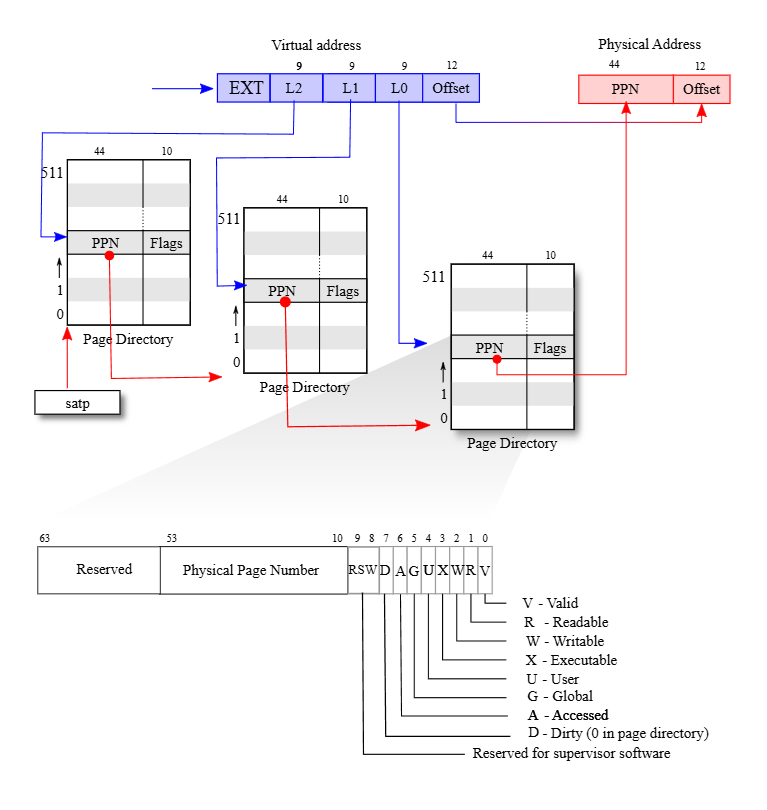
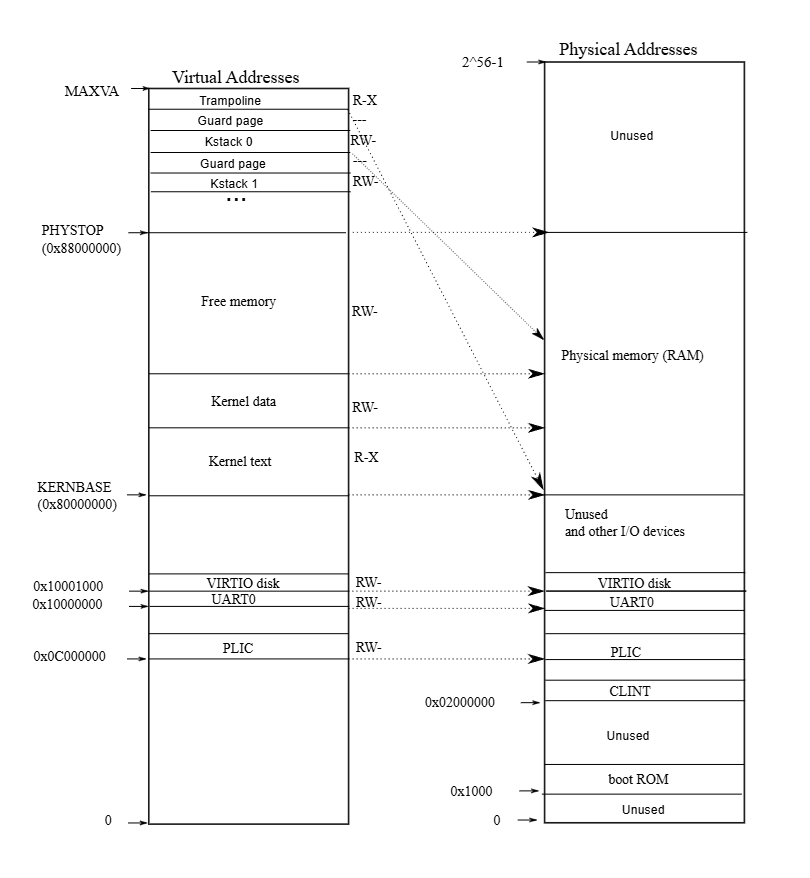
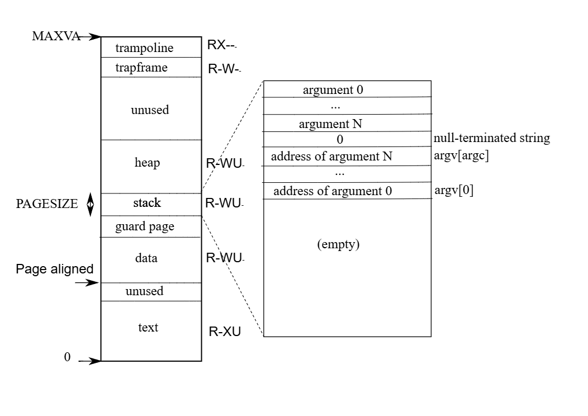

# xv6 riscv book chapter 3：Page tables

Page tables are the most popular mechanism through which the operating system provides each process with its own private address space and memory. Page tables determine what memory addresses mean, and what parts of physical memory can be accessed. They allow xv6 to isolate different processes’ address spaces and to multiplex them onto a single physical memory. Page tables provide a level of indirection that allows operating systems to perform many useful tricks. Xv6 performs a few: mapping the same memory (a trampoline page) in several address spaces, guarding kernel and user stacks with an unmapped page, and allocating user heap memory lazily. The rest of this chapter explains the page tables that the RISC-V hardware provides and how xv6 uses them.

页表是操作系统为每个进程提供独立私有地址空间和内存的最常用机制。页表决定了内存地址的含义，以及物理内存的哪些部分可以被访问。它们允许 xv6 隔离不同进程的地址空间，并将它们复用到单个物理内存上。页表提供了一层间接性，使得操作系统能够实现许多有用的技巧。xv6 实现了其中几种：在多个地址空间中映射同一块内存（trampoline 页）、使用未映射页保护内核和用户栈，以及延迟分配用户堆内存。本章接下来的部分将解释 RISC-V 硬件提供的页表以及 xv6 如何使用它们。

## 3.1 Paging hardware

As a reminder, RISC-V instructions (both user and kernel) manipulate virtual addresses. The machine’s RAM, or physical memory, is indexed with physical addresses. The RISC-V page table hardware connects these two kinds of addresses, by mapping each virtual address to a physical address.

提醒一下，RISC-V 指令（无论是用户态还是内核态）操作的都是虚拟地址。而机器的 RAM（即物理内存）则是通过物理地址进行索引的。RISC-V 的页表硬件通过将每个虚拟地址映射到物理地址，从而将这两种地址联系起来。

Xv6 uses RISC-V’s Sv39 mode, which means that only the bottom 39 bits of a 64-bit virtual address are used; the top 25 bits are not used. In this Sv39 configuration, a RISC-V page table is logically an array of page table entries (PTEs). Each PTE contains a 44-bit physical page number (PPN) and some flags. The paging hardware translates a virtual address by using the top 27 bits of the 39 bits to index into the page table to find a PTE, and making a 56 -bit physical address whose top 44 bits come from the PPN in the PTE and whose bottom 12 bits are copied from the original virtual address. Figure 3.1 shows this process with a logical view of the page table as a simple array of PTEs (the RISC-V page table is actually a tree; see Figure 3.2 for a fuller story). A page table gives the operating system control over virtual-to-physical address translations at the granularity of aligned chunks of bytes. Such a chunk is called a page.

Xv6 使用 RISC-V 的 Sv39 模式，这意味着在 64 位虚拟地址中仅使用低 39 位；高 25 位不被使用。在这种 Sv39 配置下，RISC-V 页表在逻辑上是一个包含 个页表项（PTE）的数组。每个 PTE 包含一个 44 位的物理页号（PPN）和一些标志位。分页硬件在转换虚拟地址时，利用 39 位中的高 27 位作为索引在页表中查找 PTE，并生成一个 56 位的物理地址，其高 44 位来自 PTE 中的 PPN，低 12 位则复制自原始虚拟地址。图 3.1 展示了这一过程，并将页表逻辑地视为一个简单的 PTE 数组（实际上 RISC-V 的页表是一个树状结构；详见图 3.2）。页表使操作系统能够以对齐的 字节块为粒度，控制虚拟地址到物理地址的转换。这样的块被称为一个”页”（page）。



RISC-V’s design leaves room for expansion of both virtual and physical addresses. If more virtual address space is needed, RISC-V supports an Sv48 mode, with 48-bit virtual addresses [3]. Physical addresses also have room for growth: there is room in the PTE format for the physical

RISC-V 的设计为虚拟地址和物理地址的扩展都留出了空间。如果需要更多的虚拟地址空间，RISC-V 支持 Sv48 模式，即 48 位虚拟地址 [3]。物理地址也有增长空间：PTE 格式中预留了让物理页号再增加 10 位的空间。


page number to grow by another 10 bits. The designers of RISC-V chose address sizes based on technology predictions. bytes is , a much larger user virtual address space than any application is likely to use today. bytes of physical address space is 65,536 terabytes, much more RAM than any computer can currently be equipped with.

RISC-V 的设计者根据技术预测选择了地址大小。 字节等于 ，这比当今任何应用程序可能使用的用户虚拟地址空间都要大得多。 字节的物理地址空间等于 65,536 TB，远超目前任何计算机所能配备的 RAM 容量。

As Figure 3.2 shows, a RISC-V CPU page table is stored in physical memory as a three-level tree. The root of the tree is a 4096-byte page-table page that contains 512 PTEs, which contain the physical addresses for page-table pages in the next level of the tree. Each of those pages contains 512 PTEs for the final level in the tree. The paging hardware uses the top 9 bits of the 27 bits to select a PTE in the root page-table page, the middle 9 bits to select a PTE in a page-table page in the next level of the tree, and the bottom 9 bits to select the final PTE. (In Sv48 RISC-V a page table has four levels, and bits 39 through 47 of a virtual address index into the top-level.)

如图 3.2 所示，RISC-V CPU 的页表以三级树状结构存储在物理内存中。树的根节点是一个 4096 字节的页表页，包含 512 个页表项（PTE），这些 PTE 包含了树中下一级页表页的物理地址。下一级的每个页表页同样包含 512 个 PTE，指向树的最后一级。分页硬件利用 27 位虚拟页号中的高 9 位在根页表页中选择一个 PTE，中间 9 位在下一级页表页中选择一个 PTE，最后 9 位选择最终的 PTE。（在 Sv48 RISC-V 中，页表共有四级，虚拟地址的第 39 到 47 位用于索引最高级页表。）



If any of the three PTEs required to translate an address is not present, the paging hardware raises a page-fault exception, leaving it up to the kernel to handle the page fault (see Chapters 4 and (5).

如果在地址转换过程中所需的三个 PTE 中有任何一个不存在，分页硬件就会触发缺页异常（page-fault exception），交由内核处理该缺页（参见第 4 章和第 5 章）。

The three-level structure of Figure 3.2 allows a memory-efficient way of recording PTEs, compared to the single-level design of Figure 3.1. In the common case in which large ranges of virtual addresses have no mappings, the three-level structure can omit entire page directories. For example, if an application uses only a few pages starting at address zero, then the entries 1 through 511 of the top-level page directory are invalid, and the kernel doesn’t have to allocate pages those for 511 intermediate page directories. Furthermore, the kernel also doesn’t have to allocate pages for the bottom-level page directories for those 511 intermediate page directories. So, in this example, the three-level design saves 511 pages for intermediate page directories and pages for bottom-level page directories.

与图 3.1 的单级设计相比，图 3.2 的三级结构提供了一种更节省内存的 PTE 记录方式。在大量虚拟地址范围没有映射的常见情况下，三级结构可以省略整个页目录。例如，如果一个应用程序仅使用从地址零开始的少量页面，那么顶级页目录的第 1 到 511 项将是无效的，内核无需为这 511 个中间页目录分配页面。此外，内核也无需为这 511 个中间页目录所对应的底层页目录分配页面。因此，在这个例子中，三级设计节省了 511 个中间页目录页和 个底层页目录页。

Although a CPU walks the three-level structure in hardware as part of executing a load or store instruction, a potential downside of three levels is that the CPU must load three PTEs from memory to perform the translation of the virtual address in the load/store instruction to a physical address. To avoid the cost of loading PTEs from physical memory, a RISC-V CPU caches page table entries

虽然 CPU 在执行加载（load）或存储（store）指令时，会通过硬件自动遍历这种三级结构，但三级结构的潜在缺点是 CPU 必须从内存中加载三个 PTE，才能将指令中的虚拟地址转换为物理地址。为了避免从物理内存加载 PTE 的开销，RISC-V CPU 会缓存页表项。


in a Translation Look-aside Buffer (TLB). Each PTE contains flag bits that tell the paging hardware how the associated virtual address is allowed to be used. PTE_V indicates whether the PTE is present: if it is not set, a reference to the page causes a page fault (i.e., is not allowed). PTE_R controls whether instructions are allowed to read to the page. PTE_W controls whether instructions are allowed to write to the page. PTE_X controls whether the CPU may interpret the content of the page as instructions and execute them. PTE_U controls whether instructions in user mode are allowed to access the page; if PTE_U is not set, the PTE can be used only in supervisor mode. Figure 3.2 shows where the flag bits sit in a PTE. The flags and all other page hardware-related structures are defined in (0500)

存储在转译后备缓冲区（TLB）中。每个页表项（PTE）都包含标志位，用于告知分页硬件相关虚拟地址的允许使用方式。PTE_V 表示该 PTE 是否有效：如果未设置，对该页的引用将引发缺页异常（即不允许访问）。PTE_R 控制是否允许指令读取该页。PTE_W 控制是否允许指令写入该页。PTE_X 控制 CPU 是否可以将该页的内容解释为指令并执行。PTE_U 控制用户模式下的指令是否允许访问该页；如果未设置 PTE_U，则该 PTE 仅能在内核模式（supervisor mode）下使用。图 3.2 展示了标志位在 PTE 中的位置。这些标志位以及所有其他与分页硬件相关的结构都定义在 (0500) 中。

To tell a CPU to use a page table, the kernel must write the physical address of the root pagetable page into the satp register. A CPU will translate all addresses generated by subsequent instructions using the page table pointed to by its satp. Each CPU has its own satp so that different CPUs can run different processes, each with a private address space described by its own page table.

为了告知 CPU 使用某个页表，内核必须将根页表页的物理地址写入 satp 寄存器。CPU 将使用由其 satp 指向的页表来转换后续指令产生的所有地址。每个 CPU 都有自己的 satp，因此不同的 CPU 可以运行不同的进程，每个进程都有由其自身页表描述的私有地址空间。

From the kernel’s point of view, a page table is data stored in memory, and the kernel creates and modifies page tables using code much like you might see for any tree-shaped data structure.

从内核的角度来看，页表是存储在内存中的数据，内核使用代码来创建和修改页表，这与你处理任何树形数据结构的代码非常相似。

A few notes about terms used in this book. Physical memory refers to storage cells in RAM. A byte of physical memory has an address, called a physical address. Instructions that dereference addresses (such as loads, stores, jumps, and function calls) use only virtual addresses, which the paging hardware translates to physical addresses, and then sends to the RAM hardware to read or write storage. An address space is the set of virtual addresses that are valid in a given page table; each xv6 process has a separate user address space, and the xv6 kernel has its own address space as well. User memory refers to a process’s user address space plus the physical memory that the page table allows the process to access. Virtual memory refers to the ideas and techniques associated with managing page tables and using them to achieve goals such as isolation.

关于本书中使用术语的一些说明。“物理内存”是指 RAM 中的存储单元。物理内存的一个字节有一个地址，称为“物理地址”。解引用地址的指令（如加载、存储、跳转和函数调用）仅使用“虚拟地址”，分页硬件将虚拟地址转换为物理地址，然后发送给 RAM 硬件以读取或写入存储。“地址空间”是在给定页表中有效的虚拟地址集合；每个 xv6 进程都有一个独立的用户地址空间，xv6 内核也有自己的地址空间。“用户内存”是指进程的用户地址空间加上页表允许该进程访问的物理内存。“虚拟内存”是指与管理页表以及利用页表实现隔离等目标相关的思想和技术。


## 3.2 Kernel address space

When it starts, xv6 creates a single page table describing the kernel’s address space. The kernel configures the layout of its address space to give itself access to physical memory and various hardware resources at predictable virtual addresses. Figure 3.3 shows how this layout maps kernel virtual addresses to physical addresses. The file (0200) declares the constants for xv6’s kernel memory layout.

在启动时，xv6 会创建一个描述内核地址空间的页表。内核通过配置其地址空间的布局，使其能够访问物理内存和各种硬件资源位于可预测的虚拟地址。图 3.3 展示了这种布局如何将内核虚拟地址映射到物理地址。文件 (0200) 声明了 xv6 内核内存布局的常量。



QEMU simulates a computer that includes RAM (physical memory) starting at physical address and continuing through at least , which xv6 calls PHYSTOP. The QEMU simulation also includes I/O devices such as a disk interface. QEMU exposes the device interfaces to software as memory-mapped control registers that sit below in the physical address space. The kernel can interact with the devices by reading/writing these special physical addresses; such reads and writes communicate with the device hardware rather than with RAM. Chapter 4 explains how xv6 interacts with devices.

QEMU 模拟了一台计算机，其包含的 RAM（物理内存）从物理地址 开始，一直持续到至少 ，xv6 将其称为 PHYSTOP。QEMU 模拟还包括磁盘接口等 I/O 设备。QEMU 将设备接口作为内存映射控制寄存器暴露给软件，这些寄存器位于物理地址空间中 以下的位置。内核可以通过读写这些特殊的物理地址与设备进行交互；此类读写操作是与设备硬件而非 RAM 进行通信。第 4 章解释了 xv6 如何与设备交互。

The kernel maps all physical RAM and device registers at virtual addresses equal to the physical addresses. This is called “direct mapping,” and allows the kernel to read or write physical address simply by loading or storing to virtual address . The kernel code itself is located at KERNBASE in both the virtual address space and in physical memory. When k fork (2373) allocates user memory for the child process, the allocator returns the physical address of that memory; fork uses that address directly as a virtual address when it is copying the parent’s user memory to the child.

内核将所有物理 RAM 和设备寄存器映射到与物理地址相等的虚拟地址。这被称为“直接映射”，它允许内核仅通过加载或存储虚拟地址 来读写物理地址 。内核代码本身在虚拟地址空间和物理内存中都位于 KERNBASE 。当 k fork (2373) 为子进程分配用户内存时，分配器返回该内存的物理地址； fork 在将父进程的用户内存复制到子进程时，直接将该地址用作虚拟地址。

There are a couple of kernel virtual addresses that aren’t direct-mapped:

有两个内核虚拟地址不是直接映射的：

- The trampoline page. It is mapped at the top of the virtual address space; user page tables have this same mapping. Chapter 4 discusses the role of the trampoline page, but we see here an interesting use case of page tables; a physical page (holding the trampoline code) is mapped twice in the virtual address space of the kernel: once at the top of the virtual address space and once with a direct mapping.
  蹦床页（Trampoline page）。它被映射在虚拟地址空间的顶部；用户页表也具有相同的映射。第 4 章将讨论蹦床页的作用，但我们在这里看到了页表的一个有趣用例：一个物理页（保存蹦床代码）在内核的虚拟地址空间中被映射了两次：一次在虚拟地址空间的顶部，另一次通过直接映射。
- The kernel stack pages. Each process has its own kernel stack, which is mapped at a high kernel virtual address so that below it xv6 can leave an unmapped guard page. The guard page’s PTE is invalid (i.e., PTE_V is not set), so that if the kernel overflows a kernel stack, it will likely cause a page fault and the kernel will panic. Without a guard page an overflowing stack would overwrite other kernel memory, resulting in incorrect operation. A panic crash is preferable.
  内核栈页。每个进程都有自己的内核栈，它被映射在较高的内核虚拟地址处，以便 xv6 可以在其下方留出一个未映射的保护页（Guard page）。保护页的 PTE 是无效的（即未设置 PTE_V），因此如果内核栈溢出，很可能会触发页面错误（Page fault）并导致内核恐慌（Panic）。如果没有保护页，溢出的栈会覆盖其他内核内存，导致运行错误。相比之下，触发恐慌崩溃是更好的选择。

While the kernel uses its stacks via the high-memory mappings, each is also accessible to the kernel through a direct-mapped address. An alternate design might have just the direct mapping, and use the stacks at the direct-mapped address. In that arrangement, however, providing guard pages would involve unmapping virtual addresses that would otherwise refer to physical memory, which would then be hard to use.

虽然内核通过高地址映射来使用其栈，但每个栈也可以通过直接映射地址被内核访问。另一种替代设计可能只保留直接映射，并在直接映射地址处使用栈。然而，在这种安排下，提供保护页将涉及取消映射那些本应指向物理内存的虚拟地址，这会导致那部分物理内存难以被利用。

The kernel maps the pages for the trampoline and the kernel text with the permissions PTE_R and PTE_X, but not PTE_W. The kernel maps other pages with the permissions PTE_R and PTE_W, but not PTE_X. The mappings for the guard pages are invalid. The purpose of these restricted permissions is to help catch kernel bugs that access pages in unexpected ways, for example if kernel code accidentally tried to write over kernel instructions.

内核以 PTE_R 和 PTE_X 权限映射蹦床页和内核代码段（Text）页，但不授予 PTE_W 权限。内核以 PTE_R 和 PTE_W 权限映射其他页面，但不授予 PTE_X 权限。保护页的映射是无效的。这些受限权限的目的是帮助捕获以非预期方式访问页面的内核错误，例如内核代码意外尝试改写内核指令。

The kernel creates a single kernel page table, used by all CPUs when they execute in the kernel. xv6 does not modify the kernel page table after initially creating it.

内核创建了一个唯一的内核页表，所有 CPU 在内核态执行时都使用该页表。xv6 在初始创建内核页表后不会再对其进行修改。

## 3.3 Code: creating an address space

Please read kernel/vm.c through the end of mappages () before proceeding. Most of the xv6 code for manipulating address spaces and page tables resides in vm.c (1400). The central data structure is pagetable_t, which is really a pointer to a RISC-V root pagetable page; a pagetable_t may be either the kernel page table, or one of the per-process page tables. The central functions are walk, which finds the PTE for a virtual address, and mappages, which installs PTEs for new mappings. Functions starting with kvm manipulate the kernel page table; functions starting with uvm manipulate a user page table; other functions are used for both. copyout and copyin copy data to and from user virtual addresses provided as system call arguments; they are in vm. c because they need to explicitly translate those addresses in order to find the corresponding physical memory.

在继续阅读之前，请先阅读 kernel/vm.c 直至 mappages() 函数结束。xv6 中大部分用于操作地址空间和页表的代码都位于 vm.c (1400) 中。核心数据结构是 pagetable_t，它实际上是一个指向 RISC-V 根页表页的指针；一个 pagetable_t 既可以是内核页表，也可以是某个进程的页表。核心函数包括 walk（用于查找虚拟地址对应的 PTE）和 mappages（用于为新映射安装 PTE）。以 kvm 开头的函数用于操作内核页表；以 uvm 开头的函数用于操作用户页表；其他函数则通用于两者。copyout 和 copyin 用于在系统调用参数提供的用户虚拟地址与内核之间拷贝数据；它们位于 vm.c 中，是因为它们需要显式地转换这些地址以找到对应的物理内存。

Early in the boot sequence, main calls kvminit (1465) to create the kernel’s page table using kvmmake (1421). This call occurs before xv6 has enabled paging on the RISC-V, so addresses refer directly to physical memory. kvmmake first allocates a page of physical memory to hold the root page-table page. Then it calls kvmmap to install the translations that the kernel needs. The translations include the kernel’s instructions and data, physical memory up to PHYSTOP, and memory ranges which are actually devices. proc_mapstacks (2132) allocates a kernel stack for each process. It calls kvmmap to map each stack at the virtual address generated by KSTACK, which leaves room for the invalid stack-guard pages. kvmmap (1457) calls mappages (1556), which installs mappings into a page table for a range of virtual addresses to a corresponding range of physical addresses. It does this separately for each virtual address in the range, at page intervals. For each virtual address to be mapped, mappages calls walk to find the address of the PTE for that address. It then initializes the PTE to hold the relevant physical page number, the desired permissions (PTE , and/or PTE ), and PTE_V to mark the PTE as valid (1577). walk (1497) mimics the RISC-V paging hardware as it looks up the PTE for a virtual address (see Figure 3.2). walk descends the page table tree one level at a time, using each level’s 9 bits of virtual address to index into the relevant page directory page. At each level it finds either the PTE of the next level’s page directory page, or the PTE of final page (1503). If a PTE in a first or second level page directory page isn’t valid, then the required directory page hasn’t yet been allocated; if the alloc argument is set, walk allocates a new page-table page and puts its physical address in the PTE. It returns the address of the PTE in the lowest layer in the tree (1513).

在启动序列的早期，main 会调用 kvminit (1465)，通过 kvmmake (1421) 来创建内核页表。此调用发生在 xv6 启用 RISC-V 分页机制之前，因此地址直接指向物理内存。kvmmake 首先分配一页物理内存来存放根页表页。然后它调用 kvmmap 来安装内核所需的映射。这些映射包括内核的指令和数据、直到 PHYSTOP 为止的物理内存，以及实际上是设备的内存范围。proc_mapstacks (2132) 为每个进程分配一个内核栈。它调用 kvmmap 将每个栈映射到由 KSTACK 生成的虚拟地址上，并为不可用的栈保护页（stack-guard pages）留出空间。kvmmap (1457) 调用了 mappages (1556)，后者负责在页表中建立一段虚拟地址范围到对应物理地址范围的映射。它以页为间隔，对范围内的每个虚拟地址分别进行映射。对于每个待映射的虚拟地址，mappages 调用 walk 来查找该地址对应的 PTE 地址。然后，它初始化该 PTE，使其包含相关的物理页号、所需的权限（PTE_R、PTE_W 和/或 PTE_X），并设置 PTE_V 以将该 PTE 标记为有效 (1577)。`walk` (1497) 在为虚拟地址查找 PTE 时模拟了 RISC-V 的分页硬件（见图 3.2）。`walk` 逐级下降页表树，利用虚拟地址中每一级的 9 位作为索引进入相关的页目录页。在每一级，它要么找到下一级页目录页的 PTE，要么找到最终页面的 PTE (1503)。如果第一级或第二级页目录页中的 PTE 无效，则说明所需的目录页尚未分配；如果设置了 `alloc` 参数，`walk` 会分配一个新的页表页，并将其物理地址放入该 PTE 中。它最后返回树中最低层 PTE 的地址 (1513)。

The above code depends on physical memory being direct-mapped into the kernel virtual address space. For example, as walk descends levels of the page table, it pulls the (physical) address of the next-level-down page table from a PTE (1505), and then uses that address as a virtual address to fetch the PTE at the next level down (1503).

上述代码依赖于物理内存被直接映射到内核虚拟地址空间。例如，当 `walk` 下降页表层级时，它从 PTE 中获取下一级页表的（物理）地址 (1505)，然后将该地址作为虚拟地址使用，以获取下一级的 PTE (1503)。

On each CPU, main calls kvminithart (1473) to install the kernel page table, placing the physical address of the root page-table page into the CPU’s satp register. After this the CPU translates addresses using the kernel page table. The kernel continues to execute correctly because the kernel page table is direct-mapped, so that addresses refer to the same locations in RAM before and after this change.

在每个 CPU 上，`main` 都会调用 `kvminithart` (1473) 来安装内核页表，将根页表页的物理地址放入该 CPU 的 `satp` 寄存器中。此后，CPU 将使用内核页表进行地址转换。内核能够继续正确执行，是因为内核页表是直接映射的，因此在这一更改前后，地址所指向的 RAM 位置是相同的。

Each RISC-V CPU caches page table entries in a Translation Look-aside Buffer (TLB), and when xv6 changes a page table, it must tell the CPU to invalidate corresponding cached TLB entries. If it didn’t, then at some point later the TLB might use an old cached mapping, pointing to a physical page that in the meantime has been allocated to another process, and as a result, a process might be able to scribble on some other process’s memory. The RISC-V has an instruction sfence.vma that flushes the current CPU’s TLB. Xv6 executes sfence. vma in kvminithart after reloading the satp register, and in the trampoline code for uservec and userret.

每个 RISC-V CPU 都会在转译后备缓冲区（TLB）中缓存页表项，并且当 xv6 更改页表时，必须通知 CPU 使相应的 TLB 缓存条目失效。如果不这样做，TLB 稍后可能会使用旧的缓存映射，指向在此期间已分配给另一个进程的物理页，结果可能导致一个进程能够涂改另一个进程的内存。RISC-V 拥有一条 `sfence.vma` 指令，用于刷新当前 CPU 的 TLB。Xv6 在重新加载 `satp` 寄存器后的 `kvminithart` 中，以及 `uservec` 和 `userret` 的 trampoline 代码中执行 `sfence.vma`。

It is also necessary to issue sfence. vma before changing satp, in order to wait for completion of all outstanding loads and stores. This wait ensures that preceding updates to the page table have completed, and ensures that preceding loads and stores use the old page table, not the new one.

在更改 `satp` 之前也有必要执行 `sfence.vma`，以便等待所有未完成的加载（load）和存储（store）操作完成。这种等待确保了之前对页表的更新已经完成，并确保之前的加载和存储使用的是旧页表而非新页表。

## 3.4 Physical memory allocation

The kernel must allocate and free physical memory at run-time for page tables, user memory, kernel stacks, and pipe buffers.

内核必须在运行时为页表、用户内存、内核栈和管道缓冲区分配及释放物理内存。

Xv6 uses the physical memory between the end of the kernel and PHYSTOP for run-time allocation. It allocates and frees whole 4096-byte pages at a time. It keeps track of which pages are free by threading a linked list through the pages themselves. Allocation consists of removing a page from the linked list; freeing consists of adding the freed page to the list.

Xv6 使用内核末尾到 PHYSTOP 之间的物理内存进行运行时分配。它每次分配和释放整个 4096 字节的页。它通过在空闲页本身中维护一个链表来追踪哪些页是空闲的。分配过程包括从链表中移除一个页；释放过程则包括将释放的页添加到链表中。

Please read kernel/kalloc.c.

请阅读 kernel/kalloc.c。

## 3.5 Code: Physical memory allocator

The allocator resides in kalloc.c (2950). The allocator’s data structure is a free list of physical memory pages that are available for allocation. Each free page’s “next” pointer resides in a struct run (2966). The allocator stores each free page’s run structure in the free page itself, since there’s nothing else stored there while the page is free. The free list is protected by a spin lock (2970-2973). The list and the lock are wrapped in a struct to make clear that the lock protects the fields in the struct. For now, ignore the lock and the calls to acquire and release; Chapter 7 will examine locking in detail.

分配器位于 kalloc.c (2950) 中。分配器的数据结构是一个可用于分配的物理内存页空闲链表。每个空闲页的“下一个（next）”指针存放在一个 struct run (2966) 中。分配器将每个空闲页的 run 结构体存储在空闲页本身之中，因为当页面空闲时，那里没有存储其他任何内容。该空闲链表由一个自旋锁（spin lock）保护 (2970-2973)。链表和锁被封装在一个结构体中，以明确锁保护的是该结构体中的字段。目前请忽略锁以及对 acquire 和 release 的调用；第 7 章将详细探讨锁机制。

The function main calls kinit to initialize the allocator (2976), kinit initializes the free list to hold every page of physical RAM between the end of the kernel and PHYSTOP. Xv6 ought to determine how much physical memory is available by parsing configuration information provided by the hardware. Instead xv6 assumes that the machine has 128 megabytes of RAM. kinit calls freerange to add memory to the free list via per-page calls to kfree. A PTE can only refer to a physical address that is aligned on a 4096-byte boundary (is a multiple of 4096), so freerange uses PGROUNDUP to ensure that it frees only aligned physical addresses. The allocator starts with no memory; these calls to kfree give it some to manage.

main 函数调用 kinit 来初始化分配器 (2976)。kinit 初始化空闲链表，使其包含内核末尾到 PHYSTOP 之间的每一页物理内存。xv6 本应通过解析硬件提供的配置信息来确定有多少可用物理内存，但实际上 xv6 假设机器拥有 128 MB 的 RAM。kinit 调用 freerange，通过对每一页调用 kfree 来将内存添加到空闲链表中。由于页表项（PTE）只能引用按 4096 字节边界对齐（即 4096 的倍数）的物理地址，因此 freerange 使用 PGROUNDUP 来确保它只释放对齐的物理地址。分配器初始时没有内存；这些对 kfree 的调用为它提供了可管理的内存。

The allocator sometimes treats addresses as integers in order to perform arithmetic on them (e.g., traversing all pages in freerange), and sometimes uses addresses as pointers to read and write memory (e.g., manipulating the run structure stored in each page); this dual use of addresses is the main reason that the allocator code is full of C type-casts.

分配器有时将地址视为整数，以便对其进行算术运算（例如，在 freerange 中遍历所有页面），有时又将地址用作指针来读取和写入内存（例如，操作存储在每个页面中的 run 结构体）；这种地址的双重用途是分配器代码中充满 C 语言类型转换（type-cast）的主要原因。

The function kfree (3005) begins by setting every byte in the memory being freed to the value 1. This will cause code that uses memory after freeing it (uses “dangling references”) to read garbage instead of the old valid contents; hopefully that will cause such code to break faster. Then kfree prepends the page to the free list: it casts pa to a pointer to struct run, records the old start of the free list in r->next, and sets the free list equal to r . kalloc removes and returns the first element in the free list.

kfree 函数 (3005) 首先将待释放内存中的每个字节设置为值 1。这将导致在释放后仍使用内存的代码（使用“悬空引用”）读取到垃圾内容，而不是旧的有效内容；希望这能让此类代码更快地崩溃。然后 kfree 将该页插入空闲链表的头部：它将 pa 强制转换为指向 struct run 的指针，在 r->next 中记录旧的空闲链表头部，并将空闲链表设置为 r。kalloc 则移除并返回空闲链表中的第一个元素。

## 3.6 Process address space

Each process has its own page table, and when xv6 switches between processes, it also changes page tables. Figure 3.4 shows a process’s address space in more detail than Figure 2.3. A process’s user address space starts at zero and in principle ends at MAXVA ( )(0896), though in practice only a small fraction of this is mapped to physical memory.

每个进程都有自己的页表，当 xv6 在进程之间切换时，也会随之切换页表。图 3.4 比图 2.3 更详细地展示了进程的地址空间。进程的用户地址空间从零开始，理论上止于 MAXVA ( )(0896)，但在实践中，其中只有一小部分被映射到了物理内存。



A process’s address space consists of pages that contain the text of the program (which xv6 maps with the permissions PTE_R, PTE_X, and PTE_U), pages that contain the pre-initialized data of the program, a page for the stack, and pages for the heap. Xv6 maps the data, stack, and heap with the permissions PTE_R, PTE_W, and PTE_U.

进程的地址空间由以下部分组成：包含程序指令（text）的页面（xv6 为其映射了 PTE_R、PTE_X 和 PTE_U 权限）、包含程序预初始化数据的页面、一个栈页面以及若干堆页面。Xv6 为数据、栈和堆映射了 PTE_R、PTE_W 和 PTE_U 权限。

Using permissions within a user address space is a common technique to harden a user process. If the text were mapped with PTE_W, then a process could accidentally modify its own program; for example, a programming error may cause the program to write to a null pointer, modifying instructions at address 0 , and then continue running, perhaps creating more havoc. To detect such errors immediately, xv6 maps the text without PTE_W; if a program accidentally attempts to store to address 0 , the hardware will refuse to execute the store and raises a page fault (see Chapter 4 ). The kernel then kills the process and prints out an informative message so that the developer can track down the problem.

在用户地址空间内使用权限控制是增强用户进程安全性的一种常用技术。如果指令段被映射为具有 PTE_W 权限，那么进程可能会意外修改自己的程序；例如，一个编程错误可能导致程序向空指针写入数据，从而修改地址 0 处的指令，然后继续运行，可能会造成更大的破坏。为了能立即检测到此类错误，xv6 在映射指令段时不赋予 PTE_W 权限；如果程序意外尝试向地址 0 存储数据，硬件将拒绝执行该存储操作并触发缺页异常（见第 4 章）。随后内核会杀死该进程并打印出提示信息，以便开发者追踪问题。

Similarly, by mapping data without PTE_X, a user program cannot accidentally jump to an address in the program’s data and start executing at that address.

类似地，通过在映射数据段时不赋予 PTE_X 权限，用户程序就无法意外跳转到程序数据中的某个地址并从该地址开始执行。

In the real world, hardening a process by setting permissions carefully also aids in defending against security attacks. An adversary may feed carefully-constructed input to a program (e.g., a Web server) that triggers a bug in the program in the hope of turning that bug into an exploit [14]. Setting permissions carefully and other techniques, such as randomizing of the layout of the user address space, make such attacks harder.

在现实世界中，通过仔细设置权限来增强进程安全性也有助于防御安全攻击。对手可能会向程序（例如 Web 服务器）提供精心构造的输入，从而触发程序中的漏洞，并希望将该漏洞转化为攻击手段 [14]。仔细设置权限以及其他技术（如用户地址空间布局随机化）会增加此类攻击的难度。

The stack is a single page, and is shown with the initial contents as created by the exec system call. Strings containing the command-line arguments, as well as an array of pointers to them, are at the very top of the stack. Just under that are values that allow a program to start at main as if the function main (argc, argv) had just been called.

栈的大小为一个页，图中展示了由 exec 系统调用创建的初始内容。包含命令行参数的字符串，以及指向这些字符串的指针数组，都位于栈的最顶部。紧随其后的是一些初始值，这些值使得程序能够像刚刚调用了 main(argc, argv) 函数一样从 main 开始执行。

To detect a user stack overflowing the allocated stack memory, xv6 places an inaccessible guard page right below the stack by clearing the PTE_U flag. If the user stack overflows and the process tries to use an address below the stack, the hardware will generate a page-fault exception because the guard page is inaccessible to a program running in user mode. A real-world operating system

为了检测用户栈是否溢出了所分配的栈内存，xv6 通过清除 PTE_U 标志位，在栈的正下方放置了一个不可访问的保护页（guard page）。如果用户栈发生溢出，且进程尝试使用栈下方的地址，硬件将产生一个缺页异常，因为运行在用户模式下的程序无法访问该保护页。一个现实世界的操作系统


might instead automatically allocate more memory for the user stack when it overflows. We see here a few nice examples of use of page tables. First, different processes’ page tables translate user addresses to different pages of physical memory, so that each process has private user memory. Second, each process sees its memory as having contiguous virtual addresses starting at zero, while the process’s physical memory can be non-contiguous. Third, the kernel maps a page with trampoline code at the top of the user address space (without PTE_U), thus a single page of physical memory shows up in all address spaces, but can be used only by the kernel.

相反，当用户栈溢出时，系统可能会自动为其分配更多内存。我们在这里看到了几个使用页表的绝佳示例。首先，不同进程的页表将用户地址翻译为不同的物理内存页，从而使每个进程都拥有私有的用户内存。其次，每个进程都将其内存视为从零开始的连续虚拟地址，而进程的物理内存可以是不连续的。第三，内核在用户地址空间的顶部映射了一个包含 trampoline 代码的页（不含 PTE_U 标志），因此同一个物理内存页出现在所有地址空间中，但只能由内核使用。

## 3.7 Code: exec

Please read kernel/exec.c and kernel/vm.c starting at uvmcreate(). exec is a system call that replaces a process’s user address space with data read from a file, called a binary or executable file. A binary is typically the output of the compiler and linker, and holds machine instructions and program data. kexec (6426), the kernel’s internal implementation of exec, opens the named binary path using namei (6440), which is explained in Chapter 10 , Then, it reads the ELF header. Xv6 binaries are formatted in the widely-used ELF format, defined in (0950). An ELF binary consists of an ELF header, struct elfhdr (0955), followed by a sequence of program section headers, struct proghdr (0974). Each proghdr describes a section of the application that must be loaded into memory; xv6 programs have two program section headers: one for instructions and one for data. The first step is a quick check that the file probably contains an ELF binary. An ELF binary starts with the four-byte “magic number” , ’ E ', ’ L ', ’ F ', or ELF_MAGIC(0952). If the ELF header has the right magic number, kexec assumes that the binary is well-formed. kexec allocates a new page table with no user mappings with proc_pagetable (6454), allocates memory for each ELF segment with uvmalloc (6470), and loads each segment into memory with loadseg (6409). loadseg uses walkaddr to find the physical address of the allocated memory at which to write each page of the ELF segment, and readi to read from the file.

请阅读 kernel/exec.c 以及从 uvmcreate() 开始的 kernel/vm.c。exec 是一个系统调用，它用从文件中读取的数据替换进程的用户地址空间，该文件被称为二进制文件或可执行文件。二进制文件通常是编译器和链接器的输出，包含机器指令和程序数据。内核中 exec 的内部实现 kexec (6426) 使用 namei (6440) 打开指定的二进制路径（namei 将在第 10 章中解释），然后读取 ELF 头部。Xv6 的二进制文件采用广泛使用的 ELF 格式，定义见 (0950)。一个 ELF 二进制文件由一个 ELF 头部 struct elfhdr (0955) 以及紧随其后的一系列程序段头部 struct proghdr (0974) 组成。每个 proghdr 描述了必须加载到内存中的应用程序段；xv6 程序有两个程序段头部：一个用于指令，一个用于数据。第一步是快速检查该文件是否可能包含 ELF 二进制数据。ELF 二进制文件以四个字节的“魔数” 、' E '、' L '、' F ' 或 ELF_MAGIC(0952) 开头。如果 ELF 头部具有正确的魔数，kexec 就会假设该二进制文件格式正确。kexec 使用 proc_pagetable (6454) 分配一个没有用户映射的新页表，使用 uvmalloc (6470) 为每个 ELF 段分配内存，并使用 loadseg (6409) 将每个段加载到内存中。loadseg 使用 walkaddr 查找已分配内存的物理地址，以便写入 ELF 段的每一页，并使用 readi 从文件中读取内容。

The program section header for /init, the first user program created with exec, looks like this:

通过 exec 创建的第一个用户程序 /init 的程序段头部如下所示：

```bash
# objdump -p user/_init
user/_init: file format elf64-little
Program Header:
0x70000003 off 0x0000000000006bb0 vaddr 0x0000000000000000
            paddr 0x0000000000000000 align 2**0
        filesz 0x000000000000004a memsz 0x0000000000000000 flags r--
    LOAD off 0x0000000000001000 vaddr 0x0000000000000000
            paddr 0x0000000000000000 align 2**12
        filesz 0x0000000000001000 memsz 0x0000000000001000 flags r-x
    LOAD off 0x0000000000002000 vaddr 0x0000000000001000
            paddr 0x0000000000001000 align 2**12
        filesz 0x0000000000000010 memsz 0x0000000000000030 flags rw-
    STACK off 0x0000000000000000 vaddr 0x0000000000000000
            paddr 0x0000000000000000 align 2**4
        filesz 0x0000000000000000 memsz 0x0000000000000000 flags rw-
```

We see that the text segment should be loaded at virtual address 0 x 0 in memory (without write permissions) from content at offset 0x1000 in the file. We also see that the data should be loaded at address 0x1000, which is at a page boundary, and without executable permissions.

我们看到，代码段（text segment）应该从文件的 0x1000 偏移处加载到内存的虚拟地址 0x0（不具备写权限）。我们还看到，数据段（data segment）应该加载到地址 0x1000 处，该地址位于页面边界，且不具备执行权限。

A program section header’s filesz may be less than the memsz, indicating that the gap between them should be filled with zeroes (for C global variables) rather than read from the file. For /init, the data filesz is bytes and memsz is bytes, and thus uvmalloc allocates enough physical memory to hold bytes, but reads only bytes from the file / init.

程序段头部的 filesz 可能小于 memsz，这表明两者之间的差额部分应以零填充（用于 C 语言全局变量），而不是从文件中读取。对于 /init，数据段的 filesz 为 字节，memsz 为 字节，因此 uvmalloc 分配了足以容纳 字节的物理内存，但仅从文件 /init 中读取了 字节。

Now kexec allocates and initializes the user stack. It allocates just one stack page. kexec copies the argument strings to the top of the stack one at a time, recording the pointers to them in ustack. It places a null pointer at the end of what will be the argv list passed to main. The values for argc and argv are passed to main through the system-call return path: argc is passed via the system call return value, which goes in a 0 , and argv is passed through the a 1 entry of the process’s trapframe. kexec places an inaccessible page just below the stack page, so that programs that try to use more than one page will fault. This inaccessible page also allows kexec to deal with arguments that are too large; in that situation, the copyout (1754)function that kexec uses to copy arguments to the stack will notice that the destination page is not accessible, and will return -1 .

现在 kexec 分配并初始化用户栈。它仅分配一个栈页。kexec 将参数字符串逐个拷贝到栈顶，并在 ustack 中记录指向它们的指针。它在即将传递给 main 的 argv 列表末尾放置一个空指针。argc 和 argv 的值通过系统调用返回路径传递给 main：argc 通过系统调用返回值传递（进入 a0 寄存器），而 argv 则通过进程 trapframe 的 a1 条目传递。kexec 在栈页正下方放置了一个不可访问的页面，这样尝试使用超过一个页面的程序将会触发故障。这个不可访问的页面还允许 kexec 处理过大的参数；在这种情况下，kexec 用来将参数拷贝到栈中的 copyout (1754) 函数会发现目标页不可访问，并返回 -1。

During the preparation of the new memory image, if kexec detects an error like an invalid program segment, it jumps to the label bad, frees the new image, and returns -1 . kexec must wait to free the old image until it is sure that the system call will succeed: if the old image is gone, the system call cannot return -1 to it. The only error cases in kexec happen during the creation of the image. Once the image is complete, kexec can commit to the new page table (6531) and free the old one (6535).

在准备新内存镜像的过程中，如果 kexec 检测到错误（如无效的程序段），它会跳转到标签 bad，释放新镜像并返回 -1。kexec 必须等到确定系统调用会成功后才能释放旧镜像：如果旧镜像已经消失，系统调用就无法向其返回 -1。kexec 中唯一的错误情况发生在创建镜像期间。一旦镜像完成，kexec 就可以提交新的页表 (6531) 并释放旧页表 (6535)。

The exec system call loads bytes from the ELF file into memory at addresses specified by the ELF file. Users or processes can place whatever addresses they want into an ELF file. Thus exec is risky, because the addresses in the ELF file may refer to the kernel, accidentally or on purpose. The consequences for an unwary kernel could range from a crash to a malicious subversion of the kernel’s isolation mechanisms (i.e., a security exploit). Xv6 performs a number of checks to avoid these risks. For example if (ph.vaddr + ph.memsz < ph.vaddr) checks for whether the sum overflows a 64-bit integer. The danger is that a user could construct an ELF binary with a ph.vaddr that points to a user-chosen address, and ph.memsz large enough that the sum overflows to 0x1000, which will look like a valid value. In an older version of xv6 in which the user address space also contained the kernel (but not readable/writable in user mode), the user could choose an address that corresponded to kernel memory and would thus copy data from the ELF binary into the kernel. In the RISC-V version of xv6 this cannot happen, because the kernel has its own separate page table; loadseg loads into the process’s page table, not in the kernel’s page table.

exec 系统调用根据 ELF 文件中指定的地址将字节从该文件加载到内存中。用户或进程可以在 ELF 文件中放置任何他们想要的地址。因此，exec 是具有风险的，因为 ELF 文件中的地址可能会有意或无意地指向内核。对于疏忽的内核来说，后果可能从崩溃到内核隔离机制被恶意破坏（即安全漏洞）不等。Xv6 执行了多项检查来规避这些风险。例如，`if (ph.vaddr + ph.memsz < ph.vaddr)` 检查了该总和是否超过了 64 位整数的溢出范围。其危险在于，用户可以构造一个 ELF 二进制文件，其 `ph.vaddr` 指向一个用户选择的地址，而 `ph.memsz` 足够大，使得总和溢出到 0x1000，这看起来像是一个有效值。在旧版本的 xv6 中，用户地址空间也包含内核（但在用户模式下不可读写），用户可以选择一个对应于内核内存的地址，从而将数据从 ELF 二进制文件拷贝到内核中。在 RISC-V 版本的 xv6 中，这种情况不会发生，因为内核拥有自己独立的页表；`loadseg` 加载到的是进程的页表，而不是内核的页表。

It is easy for a kernel developer to omit a crucial check, and real-world kernels have a long history of missing checks whose absence can be exploited by user programs to obtain kernel privileges. It is likely that xv6 doesn’t do a complete job of validating user-level data supplied to the kernel, which a malicious user program might be able to exploit to circumvent xv6’s isolation.

内核开发人员很容易遗漏关键的检查，而现实世界的内核在缺失检查方面有着悠久的历史，这些缺失的检查可以被用户程序利用以获取内核权限。xv6 很可能在验证提供给内核的用户级数据方面做得并不完善，恶意用户程序可能会利用这一点来规避 xv6 的隔离机制。

## 3.8 Real world

Like most operating systems, xv6 uses the paging hardware for memory protection and mapping. Most operating systems make far more sophisticated use of paging than xv6 by combining paging and page-fault exceptions, which we will discuss in Chapter 4.

与大多数操作系统一样，xv6 使用分页硬件进行内存保护和映射。大多数操作系统通过结合分页和页错误异常（我们将在第 4 章讨论），对分页的使用比 xv6 复杂得多。

Xv6 is simplified by the kernel’s use of a direct map between virtual and physical addresses, and by its assumption that there is physical RAM at address 0x80000000, where the kernel expects to be loaded. This works with QEMU, but on real hardware it turns out to be a bad idea; real hardware places RAM and devices at unpredictable physical addresses, so that (for example) there might be no RAM at 0 x 80000000 , where xv6 expect to be able to store the kernel. More serious kernel designs exploit the page table to turn arbitrary hardware physical memory layouts into predictable kernel virtual address layouts.

Xv6 通过在内核中使用虚拟地址和物理地址之间的直接映射，以及假设在地址 0x80000000（内核期望被加载的位置）存在物理 RAM，从而简化了设计。这在 QEMU 上可行，但在真实硬件上证明是一个坏主意；真实硬件将 RAM 和设备放置在不可预测的物理地址上，因此（例如）在 0x80000000 处可能没有 RAM，而 xv6 期望能够在那里存储内核。更严肃的内核设计会利用页表将任意的硬件物理内存布局转换为可预测的内核虚拟地址布局。

RISC-V supports protection at the level of physical addresses, but xv6 doesn’t use that feature. On machines with lots of memory it might make sense to use RISC-V’s support for “super pages.” Small pages make sense when physical memory is small, to allow allocation and page-out to disk with fine granularity. For example, if a program uses only 8 kilobytes of memory, giving it a whole 4-megabyte super-page of physical memory is wasteful. Larger pages make sense on machines with lots of RAM, and may reduce overhead for page-table manipulation. To avoid having to flush the complete TLB when changing page tables, RISC-V CPUs may support address space identifiers (ASIDs) [3]. The kernel can then flush just the TLB entries for a particular address space. Xv6 does not use this feature.

RISC-V 支持物理地址级别的保护，但 xv6 并没有使用这一特性。在内存容量较大的机器上，使用 RISC-V 对“大页（super pages）”的支持可能是有意义的。当物理内存较小时，使用小页更为合理，这样可以实现细粒度的分配和磁盘换出。例如，如果一个程序仅使用 8 KB 内存，为其分配一整块 4 MB 的物理内存大页将是非常浪费的。而在拥有大量 RAM 的机器上，使用更大的页则更为合理，这可以减少操作页表的开销。为了避免在切换页表时必须刷新整个 TLB，RISC-V CPU 可能支持地址空间标识符（ASIDs）[3]。这样内核就可以仅刷新特定地址空间的 TLB 条目。Xv6 并没有使用这一特性。

The xv6 kernel’s lack of a malloc-like allocator that can provide memory for small objects prevents the kernel from using sophisticated data structures that would require dynamic allocation. A more elaborate kernel would likely allocate many different sizes of small blocks, rather than (as in xv6) just 4096-byte blocks; a real kernel allocator would need to handle small allocations as well as large ones.

xv6 内核缺乏类似 malloc 的分配器来为小对象提供内存，这使得内核无法使用需要动态分配的复杂数据结构。一个更完善的内核可能会分配许多不同大小的小内存块，而不是像 xv6 那样仅分配 4096 字节的内存块；一个真实的内核分配器需要同时处理小额分配和大额分配。

Memory allocation is a perennial hot topic, the basic problems being efficient use of limited memory and preparing for unknown future requests [9]. Today people care more about speed than space efficiency.

内存分配是一个经久不衰的热门话题，其基本问题在于如何高效利用有限的内存，以及如何为未知的未来请求做好准备 [9]。如今，人们对速度的关注程度更甚于空间效率。

## 3.9 Exercises

1. Parse RISC-V’s device tree to find the amount of physical memory the computer has.
   解析 RISC-V 的设备树（device tree），以获取计算机拥有的物理内存总量。
2. The functions copyin and copyinstr walk the user page table in software. Set up the kernel page table so that the kernel has the user program mapped, and copyin and copyinstr can use memcpy to copy system call arguments into kernel space, relying on the hardware to do the page table walk.
   函数 copyin 和 copyinstr 通过软件方式遍历用户页表。请设置内核页表，使内核映射了用户程序，从而让 copyin 和 copyinstr 可以使用 memcpy 将系统调用参数拷贝到内核空间，并依靠硬件来完成页表遍历。
3. Modify xv6 to use super pages for the kernel.
   修改 xv6，使其在内核中使用大页（super pages）。
4. Unix implementations of exec traditionally include special handling for shell scripts. If the file to execute begins with the text #!, then the first line is taken to be a program to run to interpret the file. For example, if exec is called to run myprog arg1 and myprog 's first line is #!/interp, then exec runs /interp with command line /interp myprog arg1. Implement support for this convention in xv6.
   Unix 的 exec 实现传统上包含对 shell 脚本的特殊处理。如果要执行的文件以文本 #! 开头，那么第一行将被视为运行该文件的解释程序。例如，如果调用 exec 来运行 myprog arg1，而 myprog 的第一行是 #!/interp，那么 exec 将运行 /interp，命令行参数为 /interp myprog arg1。在 xv6 中实现对这一惯例的支持。
5. Implement address space layout randomization for the kernel.
   为内核实现地址空间布局随机化（ASLR）。

